# 1. Introduction
## 1.1 "Teaser" overview
From Snort Alerts to ATT&CK: Engineering a Detection Pipeline with Wazuh

A SIEM is only as valuable as its ability to detect meaningful activity. Collecting logs is straightforward, but transforming those logs into actionable intelligence requires careful integration, parsing, correlation, and validation. This project documents the design and validation of a detection pipeline using Wazuh, Snort running on pfSense, Sysmon, and Atomic Red Team to verify that simulated adversary techniques could be detected and accurately mapped to the MITRE ATT&CK framework. Along the way, I developed custom decoders and detection rules, investigated unexpected behaviors, and gained a deeper appreciation for the role that regular expressions and log parsing play in detection engineering. The project also reinforced that persistence, careful troubleshooting, and a willingness to learn from mistakes are often just as important as technical knowledge when solving complex cybersecurity problems.
## 1.2 Introducing myself to the cyber community
My path into cybersecurity has been shaped by several very different careers. I spent years working as a network engineer, designing and supporting wired and wireless networks for small and medium-sized businesses. Outside of IT, I was a nationally ranked semi-professional drone racer, where success depended on precision, rapid decision-making, and maintaining situational awareness under pressure.
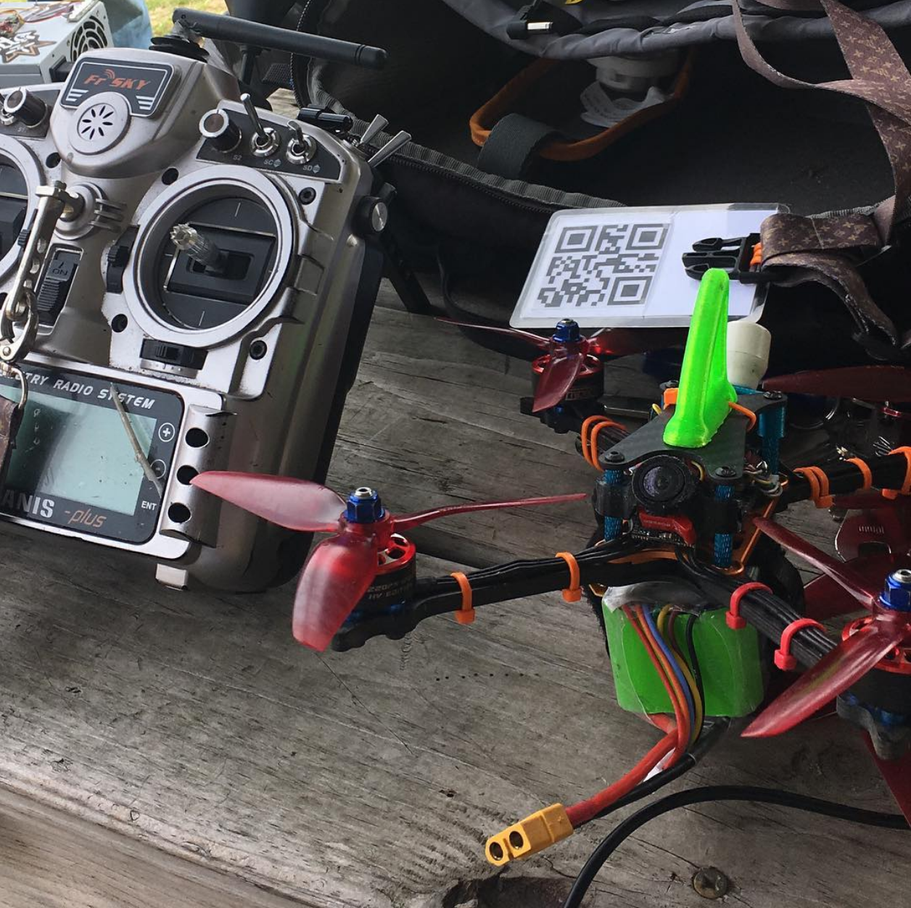
Before entering technology, I spent over a decade working in bars and restaurants, an environment that taught me how to communicate effectively, solve problems quickly, and remain calm in fast-paced, high-pressure situations. Together, those experiences naturally led me toward cybersecurity, where technical analysis, pattern recognition, and clear communication are just as important as technical knowledge. This is my first contribution to the cybersecurity community, and I hope that documenting both the successes and the challenges of this project helps someone else build, validate, or improve their own detection pipeline.

# 2. Setup

The baseline SIEM deployment provided endpoint visibility through Wazuh and Sysmon, but it lacked network intrusion detection. Since one of my goals was to validate MITRE ATT&CK techniques that generated network traffic, I decided to expand the environment by integrating [[Modification 1 (Snort IDS on pfSense)]]. My objective was to create a detection pipeline capable of combining network intrusion alerts with Windows endpoint telemetry so that both sources of evidence could be correlated within Wazuh.

I began by installing the Snort package through the pfSense Package Manager and configuring it to inspect traffic on the LAN interface. After enabling the appropriate Emerging Threats Open rule sets, I verified that Snort was successfully detecting network activity using the built-in alerts page in pfSense. With Snort functioning as expected, I configured pfSense to forward Snort alerts to the Wazuh Manager using Remote Syslog (RFC 5424), expecting the alerts to begin appearing in the Wazuh Dashboard.

Instead, Wazuh showed no evidence that the Snort alerts were being received. To determine where the problem existed, I began capturing the incoming syslog traffic on the Wazuh Manager. My initial packet capture filtered only on UDP port 514, but this produced a large volume of unrelated syslog traffic that made it difficult to determine whether the Snort alerts were actually arriving. After refining my testing and reviewing the logging configuration, I determined that Snort alerts configured to use the **LOG_LOCAL0** syslog facility were not appearing on the Wazuh Manager, despite other syslog traffic arriving successfully. 
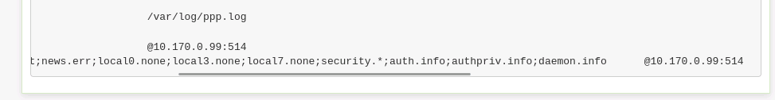

I changed Snort to use the **LOG_LOCAL1** facility instead, and the alerts immediately began appearing in Wazuh. 
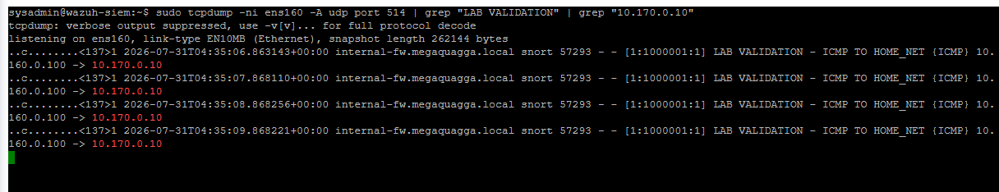
This confirmed that the network path between pfSense and the Wazuh Manager was functioning correctly and narrowed the problem to the logging configuration.

Although the alerts were now reaching Wazuh, another problem quickly became apparent. The dashboard displayed the forwarded events only as generic syslog messages. At first, I expected Wazuh's built-in Snort decoders to process the alerts automatically. After comparing the incoming logs with the default decoder definitions, I realized why they failed. The built-in decoders were designed to parse log messages generated directly by a Snort sensor. In my environment, however, pfSense wrapped the original Snort alert inside an RFC 5424 syslog message before forwarding it to Wazuh. Because the forwarded log format no longer matched what the default decoders expected, Wazuh could not extract the Generator ID (GID), Signature ID (SID), alert message, classification, priority, protocol, or source and destination addresses required by the rules engine.
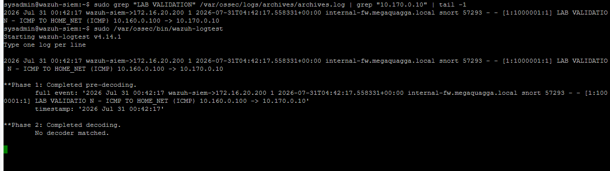

To solve this problem, I developed a custom Wazuh decoder using PCRE2 regular expressions to parse the pfSense syslog wrapper and extract the embedded Snort alert fields. After confirming that the decoder correctly populated the required values, I created custom Wazuh rules that matched selected Snort Signature IDs and enriched the resulting alerts with the appropriate MITRE ATT&CK techniques. The rules also generated descriptive alerts containing the parsed protocol, source and destination addresses, and signature information, allowing the alerts to be correlated with endpoint telemetry collected from Sysmon and the Windows Event Logs.
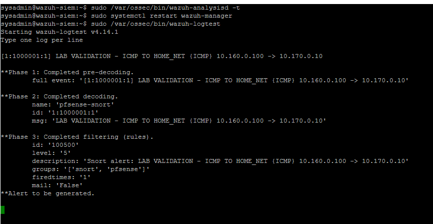


The most significant mistake I made during this modification was attempting to build a single complex regular expression that parsed the entire forwarded Snort log in one step. ([[Wazuh Decoder for Snort alerts is not parsing alert data]]) Although Wazuh was successfully receiving the syslog messages, the decoder repeatedly failed because my regular expression did not accurately match the pfSense-wrapped Snort log format. Initially, I spent too much time investigating other components of the detection pipeline before realizing that the parser itself was responsible for the missing fields. Once I changed my approach, I validated the decoder incrementally by first confirming that it attached to the incoming log, then extracting one field at a time before gradually expanding the regular expression until every required value was parsed successfully. That incremental approach proved far more effective than attempting to solve the entire parsing problem with a single expression.
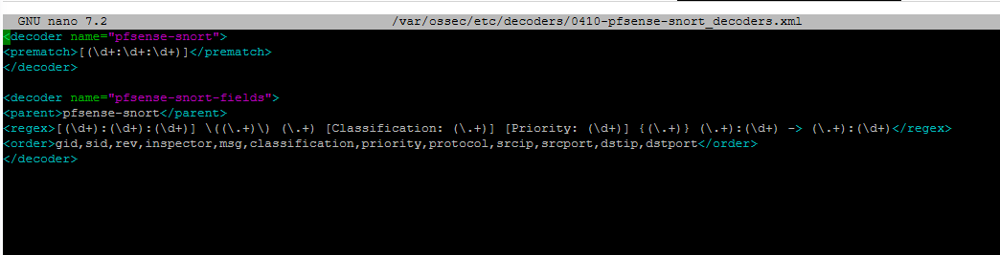
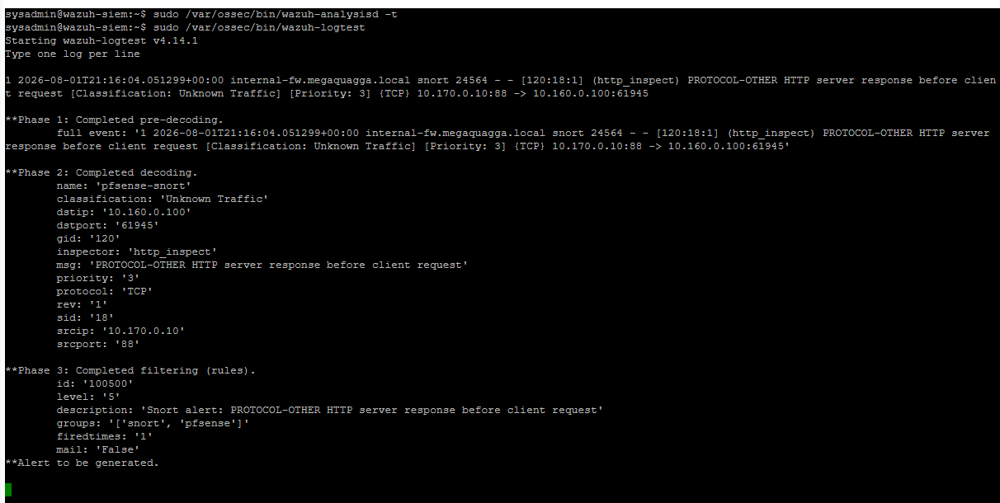


With the forwarding configuration, custom decoder, and custom rules functioning correctly, the detection pipeline operated as intended. Snort analyzed traffic traversing the pfSense firewall and generated alerts whenever configured signatures matched observed network activity. pfSense forwarded those alerts to the Wazuh Manager using Remote Syslog (RFC 5424). The custom decoder parsed the embedded Snort alert from the pfSense syslog message into structured fields, and the custom rules evaluated the extracted values before enriching the alerts with the appropriate MITRE ATT&CK mappings. This completed the integration between Snort and Wazuh and provided the foundation for the three validation experiments presented in the following section.

# 3. Experiment Time!

## 3.1 Experiment #1 - Network Service Discovery (T1046)

I began by validating the network detection pipeline using T1046 Network Service Discovery. Because an Nmap service scan generates recognizable network traffic without modifying the target system, it provided an ideal first test of the Snort integration.

At the beginning of the experiment, I expected the workflow to be straightforward. Snort would detect the Nmap scan, pfSense would forward the alerts to the Wazuh Manager, and Wazuh's built-in Snort decoder would parse the forwarded events automatically.

Using Atomic Red Team, I executed the Nmap service discovery test against the Active Directory server while monitoring Snort, pfSense, Wazuh, Windows Sysmon, and packet captures. Start and end timestamps were recorded so events from each platform could be correlated throughout the experiment.

Snort detected the reconnaissance traffic immediately, but the alerts never appeared in Wazuh. Since other pfSense syslog messages were reaching the Wazuh Manager successfully, the problem was isolated to the Snort logging configuration rather than the network connection itself. After reviewing the configuration, I discovered that Snort alerts generated using the ```LOG_LOCAL0``` syslog facility were not being forwarded to Wazuh. Changing Snort to use the ```LOG_LOCAL1``` facility immediately resolved the forwarding issue, and the alerts began appearing on the Wazuh Manager.

Once the alerts were reaching Wazuh, another problem became apparent. The built-in Snort decoder did not parse the forwarded events because it expected log messages generated directly by a Snort sensor. In this environment, pfSense wrapped the original Snort alert inside an RFC 5424 syslog message before forwarding it, changing the log format presented to Wazuh. As a result, the Generator ID (GID), Signature ID (SID), alert message, classification, priority, protocol, and network addresses remained embedded inside the raw syslog message.

To solve this problem, I developed a custom decoder using PCRE2 regular expressions to extract the embedded Snort fields from the forwarded pfSense syslog message. My initial regular expressions repeatedly failed to match the incoming log correctly, so I changed my approach and validated the decoder incrementally by extracting one field at a time before expanding the expression. Once the decoder successfully populated every required field, I created custom Wazuh rules that matched the configured Emerging Threats Open Signature IDs and mapped the resulting alerts to MITRE ATT&CK Technique T1046.

By the conclusion of the experiment, the complete detection pipeline was functioning correctly. Snort detected the Nmap scan, pfSense forwarded the alerts using ```LOG_LOCAL1```, the custom decoder parsed the forwarded syslog message, and the custom rules successfully associated the configured Snort Signature IDs with MITRE ATT&CK Technique T1046 within the Wazuh Dashboard.

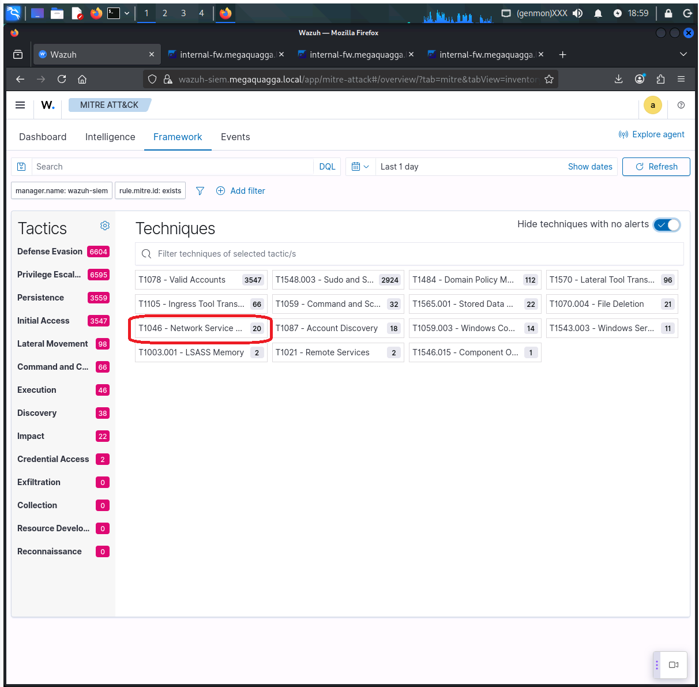
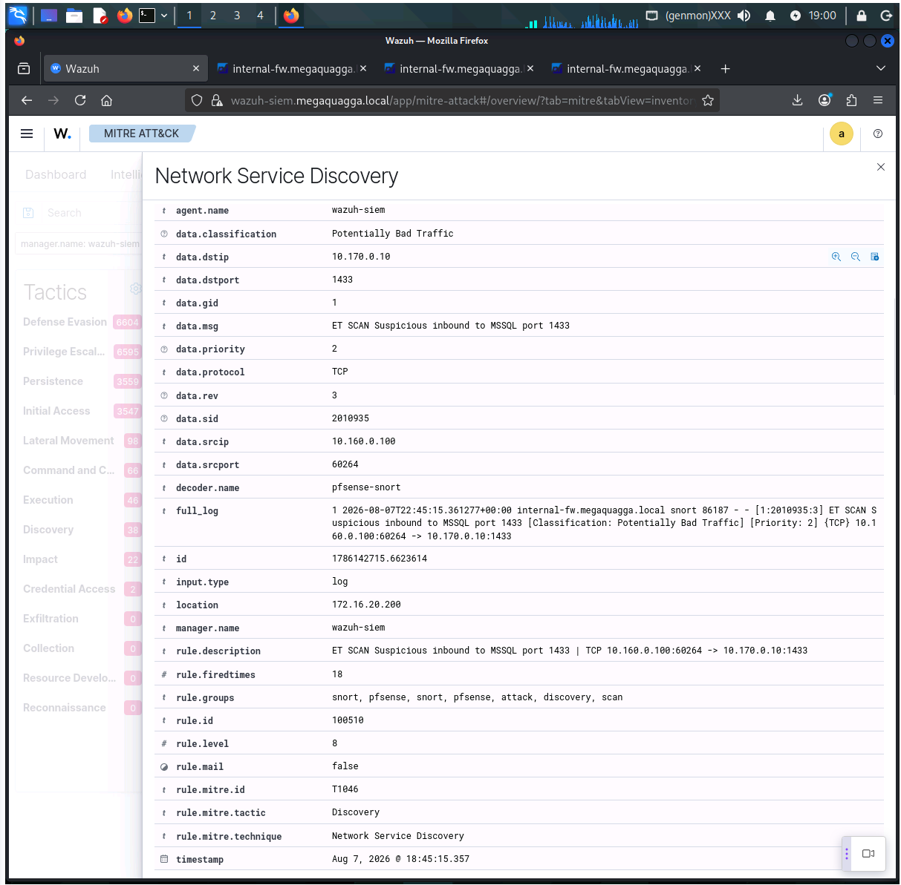
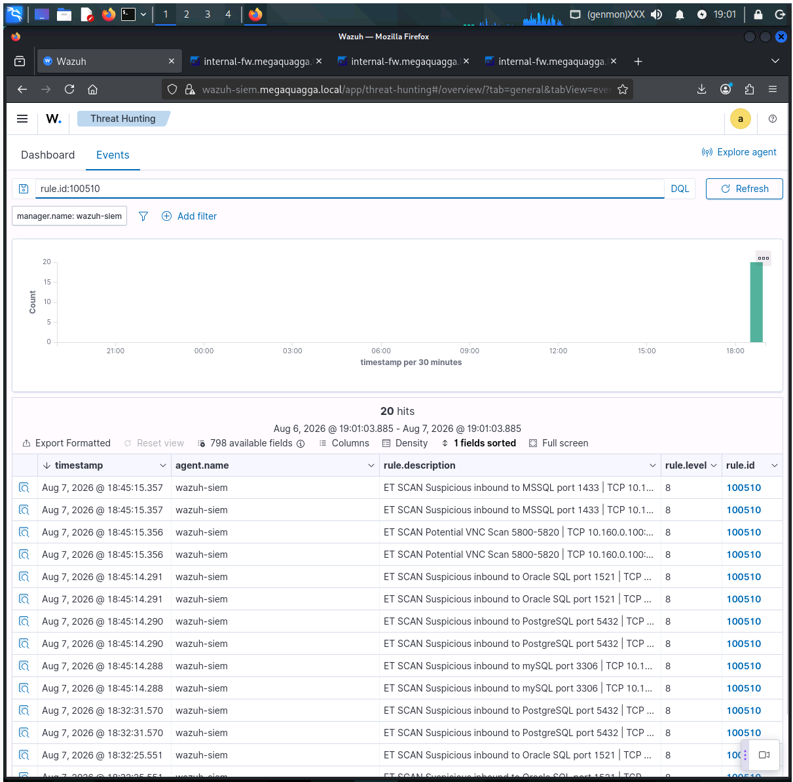

## 3.2 Experiment #2 - Command and Scripting Interpreter: PowerShell (T1059.001)

The second experiment focused on endpoint telemetry by emulating malicious PowerShell execution using T1059.001 PowerShell. Unlike the first experiment, which primarily generated network reconnaissance traffic, this test evaluated Windows event collection, Sysmon logging, and Wazuh's ability to identify suspicious command execution.

Several Atomic Red Team PowerShell tests were executed while monitoring Windows Event Viewer, Sysmon, Snort, pfSense, and Wazuh. The activity generated Windows process creation events, PowerShell Operational logs, and Sysmon telemetry while also producing network traffic observable by Snort.

Windows generated the expected endpoint telemetry, and Wazuh successfully collected and correlated the resulting events. One interesting observation was that although the Atomic Red Team technique represented T1059.001 PowerShell, Wazuh associated portions of the observed behavior with MITRE ATT&CK Technique T1059.003 Windows Command Shell because ```cmd.exe``` participated in the execution chain before PowerShell launched. Rather than modifying the existing detection logic to force the expected ATT&CK technique, I documented the behavior exactly as it was observed.
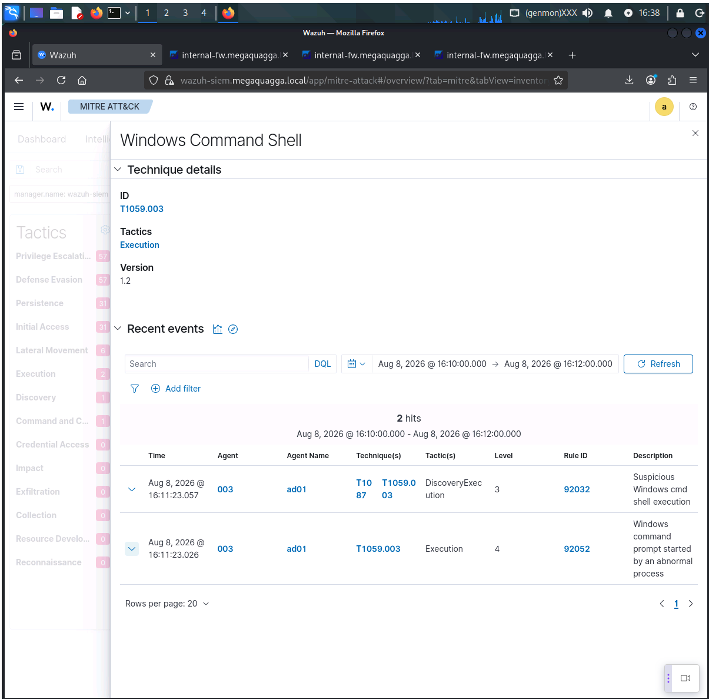
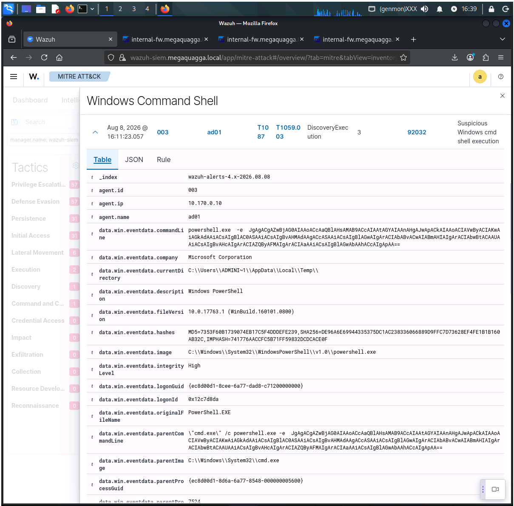
The PowerShell activity also generated Snort alerts, which were forwarded through pfSense and processed successfully by the custom decoder and rules. This experiment demonstrated that the detection pipeline could simultaneously correlate network and endpoint telemetry generated during a single attack technique.

## 3.3 Experiment #3 – Lateral Movement via SMB and Remote Services (T1021.002)

The final experiment focused on authenticated lateral movement using T1021.002 – SMB/Windows Admin Shares. This technique generated activity across multiple independent data sources simultaneously, including SMB network traffic, Windows authentication events, administrative share access, and endpoint process execution.

Before executing the Atomic Red Team test, I verified connectivity from the ART workstation to TCP port 445 on the Active Directory server and confirmed that the ```C$``` administrative share was accessible. I then executed the PowerShell administrative-share mapping test while monitoring Snort, pfSense, Wazuh, Windows Security logs, Sysmon, and packet captures.

The experiment generated the expected telemetry throughout the environment. Snort detected the SMB traffic and generated alerts that were forwarded through pfSense to Wazuh. Windows recorded successful authentication and SMB-related events, while Sysmon captured the associated process activity. Wazuh successfully collected and correlated both the network and endpoint telemetry generated during the simulated lateral movement.

Initially, I believed the experiment had failed because the mapped ```G:``` PowerShell drive was no longer present after the Atomic Red Team test completed. Rather than assuming the attack itself had failed, I reviewed the evidence collected across the environment. Atomic Red Team completed successfully with Exit Code 0 and displayed the mapped ```G:``` drive during execution. Snort detected the SMB communication, Windows recorded successful authentication and SMB share access, and manual testing confirmed that the ```C$``` administrative share could be mapped successfully using PowerShell.
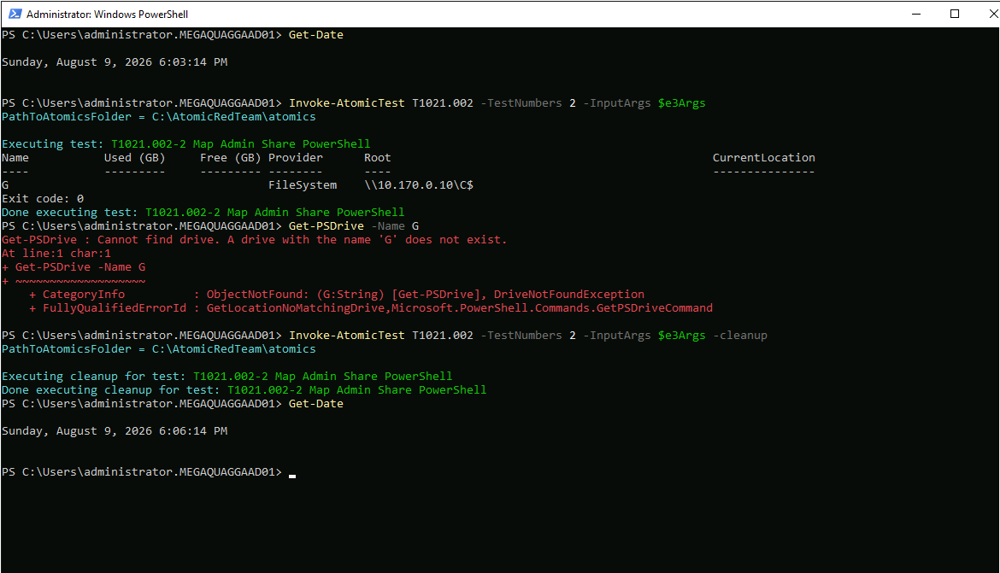
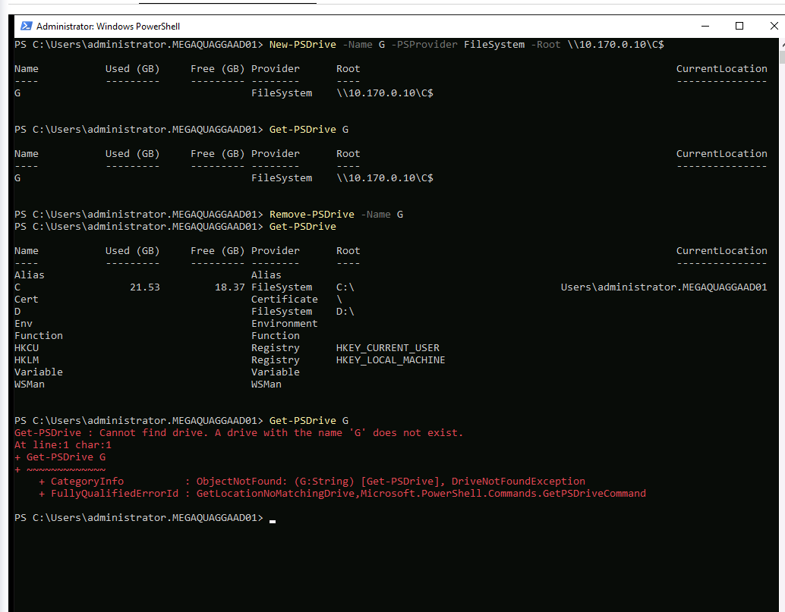
The combined evidence demonstrated that the SMB administrative-share activity had executed successfully and that the disappearance of the temporary PowerShell drive after the Atomic Red Team command completed was behavior specific to the test implementation rather than a failure of the attack or the detection pipeline. The experiment confirmed that the completed detection pipeline could successfully correlate network detections, authentication events, endpoint telemetry, and custom Snort detections within Wazuh.

# 4. Conclusion
## 4.1 Summary of experimental findings
The three experiments demonstrated that the completed detection pipeline was capable of detecting and correlating realistic adversary activity across multiple telemetry sources. The Network Service Discovery experiment validated the custom Snort integration, decoder, and rules by successfully detecting reconnaissance traffic and mapping the configured Snort signatures to MITRE ATT&CK Technique T1046. The PowerShell experiment confirmed that Wazuh and Sysmon effectively collected endpoint telemetry while also correlating associated network activity generated during execution. Finally, the SMB lateral movement experiment demonstrated that network detections, Windows authentication events, and endpoint telemetry could all be correlated within Wazuh to provide a comprehensive view of the simulated attack.
## 4.2 Advice on avoiding mistakes
The most valuable lesson from this project was the importance of validating each stage of a detection pipeline independently before assuming the problem exists elsewhere. In my case, the first issue was that Snort alerts configured to use ```LOG_LOCAL0``` were not reaching Wazuh. After resolving that issue by switching to ```LOG_LOCAL1```, I discovered that Wazuh's default Snort decoder could not parse the pfSense-wrapped syslog messages, requiring the development of a custom decoder. Finally, debugging the decoder reinforced the value of testing regular expressions incrementally instead of attempting to parse an entire log format in a single expression. Breaking complex problems into smaller, verifiable steps proved to be the most effective troubleshooting strategy throughout the project. Just as importantly, taking the time to thoroughly read the documentation before making configuration changes or assumptions can save a significant amount of troubleshooting time. Several of the obstacles I encountered could have been identified much earlier by consulting the relevant documentation before diving into implementation. 

# 5. Final Thoughts
## 5.1 The coolest thing I learned
The coolest thing I learned during this project was how powerful regular expressions can be when combined with PCRE2. Before this project, regular expressions were something I had only used occasionally, and I certainly didn't appreciate how much of modern detection engineering depends on them. Developing a custom Wazuh decoder forced me to understand exactly how raw log data is structured and how each individual value can be extracted and transformed into meaningful security information. Watching a raw Snort alert evolve from an unparsed syslog message into a fully enriched Wazuh alert with MITRE ATT&CK mappings gave me a much greater appreciation for the work that goes into detection engineering. It also showed me that writing regular expressions is less about memorizing syntax and more about understanding the structure of the data you're trying to parse.
## 5.2 One piece of advice
If I could give one piece of advice to someone building a similar detection pipeline, it would be to keep moving forward and not become discouraged by mistakes or lack of experience. Every obstacle I encountered taught me something new about how the system actually worked. There were several points where it would have been easy to assume the project was simply broken, but every issue ultimately had a logical explanation. Break large problems into smaller ones, verify each component independently, and don't be afraid to revisit your assumptions. Progress often comes from persistence rather than finding the perfect solution on the first attempt.

## 5.3 My favorite resource
My favorite resource throughout this project was Build Regex (https://buildregex.com/). I discovered it while troubleshooting my custom Wazuh decoder, and it quickly became an invaluable tool for understanding and constructing increasingly complex PCRE2 regular expressions. Rather than relying entirely on trial and error, I was able to build expressions incrementally, immediately visualize what each portion of the pattern matched, and refine the decoder much more efficiently. It significantly reduced the time required to troubleshoot my parser and helped me develop a much stronger understanding of regular expressions than I would have gained by simply copying examples from documentation.
## 5.4 Thank you!
I would first like to thank Rick Rhaburn and Arus Sukiasyan at TripleTen. Their guidance, encouragement, and willingness to answer questions throughout the program helped me approach problems methodically rather than becoming overwhelmed by them. They consistently emphasized understanding why something worked instead of simply following instructions, which had a significant impact on how I approached this project.

I would also like to thank Benjamin Palmer from CloudShare Support for helping resolve issues with the CloudShare lab environment. Reliable access to the lab environment was essential for completing the experiments, and his assistance allowed me to continue working through the project without unnecessary delays.

Finally, I would like to thank Matt Johansen (Vulnerable U) and the team at RedBlue Labs for the educational content they continue to produce for the cybersecurity community. Their videos, demonstrations, and practical explanations helped reinforce many of the concepts I encountered throughout this project and provided additional context that extended beyond the course material. Their willingness to share knowledge publicly makes the cybersecurity community more accessible for newcomers while continuing to challenge experienced practitioners alike.

# 6. References

## 6.1 [[Web - Wazuh User Manual - Decoders]]
- https://documentation.wazuh.com/current/user-manual/ruleset/decoders/custom.html
## 6.2 [[Web - pfSense XML Configuration File Documentation]]
- https://docs.netgate.com/pfsense/en/latest/config/xml-configuration-file.html
## 6.3 [[Web - Wazuh User Manual - Rules]]
- https://documentation.wazuh.com/current/user-manual/ruleset/rules/custom.html
## 6.4 [[Web - Wazuh User Manual - Ruleset XML Syntax - PCRE2]]
- https://documentation.wazuh.com/current/user-manual/ruleset/ruleset-xml-syntax/pcre2.html
## 6.5 [[YouTube - Set Up Snort in PFSense From Scratch (IDS and IPS)]]
- RedBlue Labs
- https://www.youtube.com/watch?v=SapAcfHbQSE